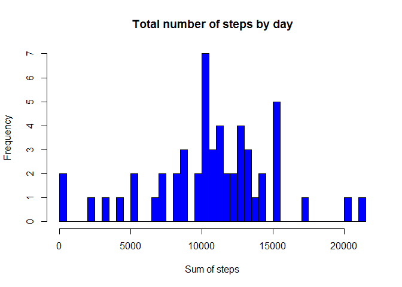
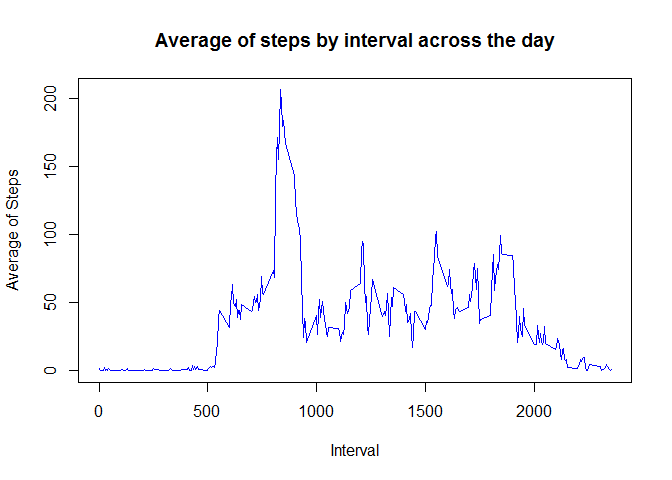
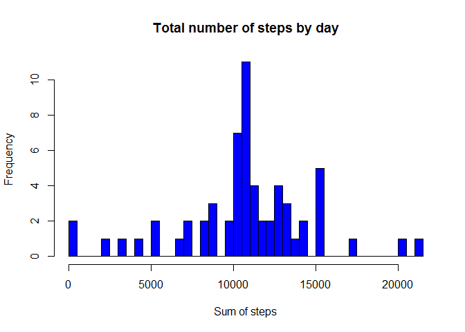
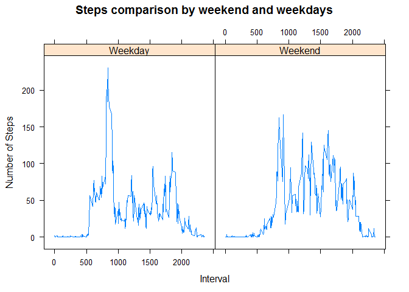

# Reproducible Research: Peer Assessment 1


## Loading and preprocessing the data

Generic chunk of code to upload all libraries needed for this assignment


```r
library(dplyr)
library(lattice)

## English by default
Sys.setlocale("LC_ALL", "English")
```

In this R chunck, we proceed to read data, convert field date from factor to date class and summarise data by day (to be used in the histogram, next point).


```r
##Upload steps data from activity.csv
steps <- read.csv("./data/activity.csv")

## Transform date column to date class
steps[, c(2)] <- as.Date(steps[, c(2)], format="%Y-%m-%d")

## Ignore NA data
steps_no_NA <- subset(steps, !is.na(steps))

## Sum steps by day
steps_by_day <- group_by(steps_no_NA, date) %>% summarise(steps = sum(steps))
```


## What is mean total number of steps taken per day?


To see the number of steps and their frequencies, we will create a histogram that shows the frequency of the total number of steps by day.


```r
hist(steps_by_day$steps, breaks=nrow(steps_by_day), main="Total number of steps by day", xlab="Sum of steps", col="blue")
```

 

**Median and Average values**

The average number of steps by day is **10770**

The median number of steps by day is **10760**


## What is the average daily activity pattern?

Let's see what's the average of steps by interval. The R code to create and plot the average by interval as follows:


```r
## Avarage of steps by interval
steps_by_interval <- group_by(steps_no_NA, interval) %>% summarise(av_steps = mean(steps))

##Plot x axis = Interval and y axis = Average of Steps by interval
plot(steps_by_interval$interval, steps_by_interval$av_steps, type="l", main="Average of steps by interval across the day", 
     xlab="Interval", ylab="Average of Steps", col="blue")
```

 

```r
## Get the interval with the maximum step value
steps_max_value <- subset(steps_by_interval, av_steps == max(av_steps))
```

**Maximum average value and interval**

Maximum number of steps in average is **206** within the interval **835**


## Imputing missing values

There are **2304** step measurements with the value NA. In order to make a better analysis we are going to replace these NA values by the mean of 5-min interval. Below, the R code chunck to replace NA values and make a histogram.


```r
## Replace NA values for steps by the mean of this 5-min interval
steps_fill_in <- merge(steps, steps_by_interval) %>% mutate(new_steps = ifelse(is.na(steps), av_steps, steps)) %>% select(interval, date, steps = new_steps)

steps_by_day <- group_by(steps_fill_in, date) %>% summarise(steps = sum(steps))

hist(steps_by_day$steps, breaks=nrow(steps_by_day), main="Total number of steps by day", xlab="Sum of steps", col="blue")
```

 

**Median and Average values**

The average number of steps by day is **10770**

The median number of steps by day is **10770**


As we can see, assigning the interval mean values to the NA values, we are getting a very similar values for median and mean. In fact, now median and mean are getting the same value.


## Are there differences in activity patterns between weekdays and weekends?

Now, let's see if there are differences in the steps behavior between weekdays and weekends. Below the R code to add the column that informs if the day is weekend or weekday, we plot it using lattice package.


```r
## Create a new column to determine if the date is weekend or weekday
steps_fill_in <- mutate(steps_fill_in, day = ifelse(weekdays(steps_fill_in$date) == "Saturday" | weekdays(steps_fill_in$date) == "Sunday", "Weekend", "Weekday"))

## Convert new column to factor
steps_fill_in$day <- as.factor(steps_fill_in$day)

## Calculate averages by interval and day (either weekends or weekdays)
steps_fill_in_average_interval <- group_by(steps_fill_in, interval, day) %>% summarise(av_steps = mean(steps))

# scatterplots type line to see if there is a different pattern beteen weekends and weekdays 
xyplot(steps_fill_in_average_interval$av_steps~steps_fill_in_average_interval$interval|steps_fill_in_average_interval$day, 
       main="Steps comparison by weekend and weekdays", 
   ylab="Number of Steps", xlab="Interval", type="l")
```

 

In general, we can see on the plot a little bit more activity during weekends. And we can clarify it calculating total mean and median for weekends and weekdays. Below the R code chunck to see number of steps by weekend and weekdays


```r
## Calculate averages by interval and day (either weekends or weekdays)
steps_fill_in_average_day <- group_by(steps_fill_in, date, day) %>% summarise(steps = sum(steps))
```

**<u>Weekends</u>**

*Mean:* 1.220152e+04

*Median:* 1.164600e+04


**<u>Weekdays</u>**

*Mean:* 1.025585e+04

*Median:* 1.076500e+04


